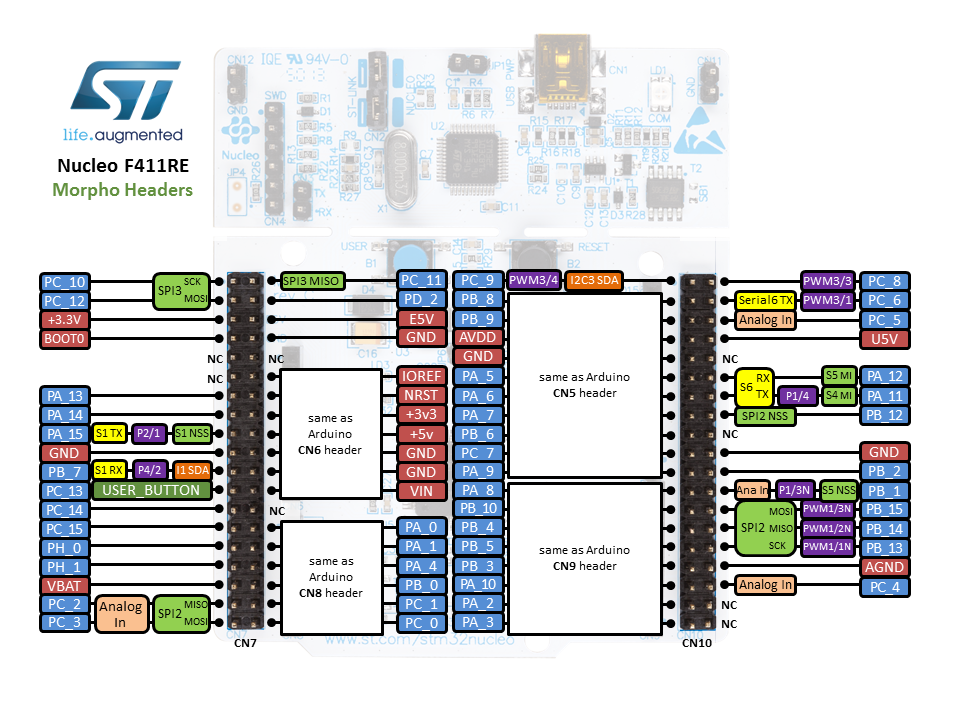
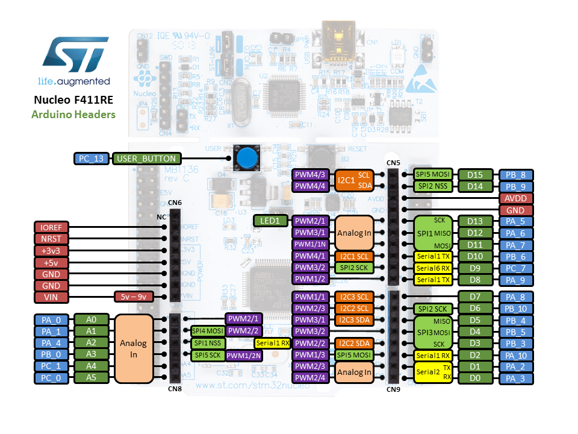

# `f4`

> Board Support Crate for the NUCLEO-F411RE

[NUCLEO-F411RE]: http://www.st.com/en/evaluation-tools/nucleo-f411re.html

## [Documentation](https://docs.rs/f3)

## [Change log](CHANGELOG.md)

## License

Licensed under either of

- Apache License, Version 2.0 ([LICENSE-APACHE](LICENSE-APACHE) or
  http://www.apache.org/licenses/LICENSE-2.0)
- MIT license ([LICENSE-MIT](LICENSE-MIT) or http://opensource.org/licenses/MIT)

at your option.

### Contribution

Unless you explicitly state otherwise, any contribution intentionally submitted
for inclusion in the work by you, as defined in the Apache-2.0 license, shall be
dual licensed as above, without any additional terms or conditions.

### d7018e - special studies in embedded systems

#### Grade 3
Port code from f3 and/or bluepill crates to the F411RE. Example code from these crates are working.

#### Grade 4
Implement easy way to change between different peripheral pin configuration. Also, to set clock frequency other than the default 16 MHz (PLL).

#### Grade 5
Have the RTFM core use some external peripheral such as an IMU over SPI. Working demo of it.

### Docs
[Nucleo 64 Manual](docs/Nucleo-64-User-manual.pdf)

[STM32F411 Datasheet](docs/STM32F411_Datasheet.pdf)

[STM32F411 Reference Manual](docs/STM32F411_Reference_Manual.pdf)

